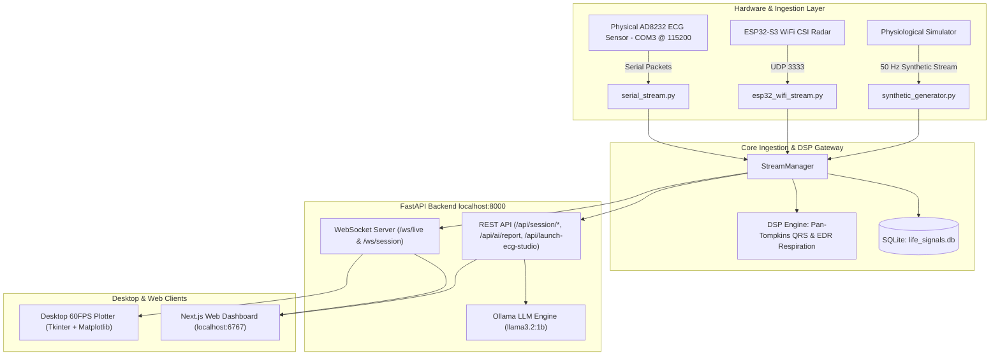

# 🫀 CAMERA 505 — Sleep Intelligence & Cardiorespiratory Platform
> **Tagline:** *WE DON'T SUPPORT 67*  
> **Repository Path:** `C:\Users\cercu\.gemini\antigravity\scratch\camera 505 hackathon`  
> **Architecture Version:** 2.1.0 • Clinical Edge Multimodal System

---

## 📌 1. Master System Prompt (Copy-Paste Ready for Any Agent/Tool)

```markdown
You are a senior biomedical engineer and full-stack software architect working on CAMERA 505 (formerly LIFE / THORES).
CAMERA 505 is a real-time, edge-native clinical cardiorespiratory monitoring and obstructive sleep apnea (OSA) intelligence platform.

### Core Philosophy & Rules:
1. Branding: "CAMERA 505 — Sleep Intelligence Platform" (Tagline: *WE DON'T SUPPORT 67*).
2. Design Language: Pure Apple Dark Mode (#0A0A0C background, #161618 elevated cards, #242428 borders, #6E56CF indigo primary, #30D158 Apple green, #FF453A Apple red). No garish gradients, system font stack.
3. Hardware Integration: Physical 3-lead AD8232 ECG via Arduino UNO / ESP-32 on COM3 @ 115200 baud (fallback to 50 Hz physiological simulation or WiFi CSI radar).
4. Edge AI: CatBoost 12-Cohort Classifier for ESRS baseline calibration + 10-step RoPE 512D Foundation Model + Local Ollama (llama3.2:1b) clinical narrative reports.

### Local Project Directory Structure:
- Root: `C:\Users\cercu\.gemini\antigravity\scratch\camera 505 hackathon`
- Frontend: `life-mobile/` (Next.js 15 App Router, React 19, Tailwind CSS, TypeScript, Port 6767)
- Backend: `src/backend/app.py` (FastAPI, Uvicorn, WebSockets, SQLite, Port 8000)
- Desktop Plotter: `scripts/desktop_ecg_plotter.py` (Tkinter + Matplotlib 60 FPS live oscilloscope & FFT)
- Signal Ingestion: `src/ingestion/` (serial_stream.py, esp32_wifi_stream.py, synthetic_generator.py)
- DSP & ML: `src/dsp/` (ecg_dsp.py Pan-Tompkins, audio_dsp.py) & `src/ai/` (ollama_engine.py)
```

---

## 🏗️ 2. Detailed Technical Architecture



---

## 📂 3. File Map & Responsibilities

| Path | Role / Description |
|---|---|
| `life-mobile/app/dashboard/page.tsx` | **Main Dashboard**: Real-time signals, Last Night summary, sleep stages bar, live 2x2 KPIs, dynamic Lead-II ECG oscilloscope. |
| `life-mobile/app/dashboard/night/page.tsx` | **Night Session Workflow**: 4 states (`idle` -> `active` -> `scoring` -> `report`). Auto-launches desktop plotter, streams WS, computes AHI, generates AI report. |
| `life-mobile/app/dashboard/history/page.tsx` | **Historical Analytics**: 7-day AHI severity bar chart, summary metrics (Avg AHI, Best Stability), detailed night session logs. |
| `life-mobile/app/dashboard/profile/page.tsx` | **Profile & AI Cohort**: Displays the exact matched ESRS clinical cohort ($\theta_0, \tau_0$, baseline HR/Resp), answers to all 9 quiz questions, and stats. |
| `life-mobile/app/quiz/page.tsx` | **ESRS Intake Quiz**: 9-step clinical questionnaire, CatBoost classification terminal animation, saves `camera505_profile`. |
| `life-mobile/components/layout/AppShell.tsx` | **Layout Shell**: Fixed 64-width desktop sidebar (`md:pl-64` offset), frosted glass mobile bottom nav, desktop studio launcher. |
| `src/backend/app.py` | **FastAPI Gateway**: WebSocket `/ws/live`, REST endpoints (`/api/session/start`, `/api/session/stop`, `/api/ai/report`, `/api/launch-ecg-studio`, `/api/com-ports`). |
| `scripts/desktop_ecg_plotter.py` | **Desktop Studio**: Native Tkinter + Matplotlib 60 FPS oscilloscope, real-time FFT spectrum (0–20 Hz), QRS peak marker, HRV RMSSD. |
| `src/dsp/ecg_dsp.py` | **ECG DSP Engine**: Pan-Tompkins real-time QRS detection, R-R interval extraction, HRV metrics, ECG-Derived Respiration (EDR). |
| `src/ai/ollama_engine.py` | **Local AI Engine**: Auto-pulls `llama3.2:1b`, generates clinical sleep narrative, recovery score, and nightly recommendations. |

---

## 🧬 4. ESRS Clinical Diagnostic Cohorts (CatBoost Model)

The intake quiz classifies patients into **1 of 12 clinical cohorts** with personalized prior baselines:

| Cohort Name | Key | Risk Level | $\theta_0$ (Apnea Prior) | $\tau_0$ (Temporal Prior) | Baseline HR | Baseline Resp |
|---|---|---|---|---|---|---|
| **Obese High-Risk OSA (SHHS)** | `obese_high_risk` | `HIGH` | `0.52` | `0.65` | `82 bpm` | `17.0 rpm` |
| **Senior Hypertensive (MESA/SHHS)** | `senior_hypertensive` | `HIGH` | `0.48` | `0.60` | `78 bpm` | `16.0 rpm` |
| **Severe OSA Candidate (UCDDB)** | `severe_osa` | `HIGH` | `0.55` | `0.70` | `80 bpm` | `18.0 rpm` |
| **Snoring & Mild Apnea (SHHS/MESA)**| `snoring_mild` | `ELEVATED` | `0.38` | `0.55` | `74 bpm` | `15.2 rpm` |
| **Postmenopausal Female (DREAMS)** | `postmenopausal_female`| `ELEVATED` | `0.35` | `0.52` | `71 bpm` | `14.5 rpm` |
| **Insomnia & Non-Apnea Fatigue** | `insomnia_fatigue` | `LOW` | `0.28` | `0.45` | `68 bpm` | `13.8 rpm` |
| **Athletic & High HRV (Fantasia)** | `young_athlete` | `LOW` | `0.22` | `0.40` | `54 bpm` | `12.0 rpm` |
| **Healthy Adult Baseline (APNEA-ECG)**| `healthy_adult` | `LOW` | `0.30` | `0.48` | `70 bpm` | `14.0 rpm` |

---

## 💾 5. Data Persistence & LocalStorage Keys

All patient data is stored locally without third-party cloud leakage:

| Key | Type | Description |
|---|---|---|
| `camera505_user` | JSON | `{ email: string, name: string }` — Logged in patient details. |
| `camera505_profile` | JSON | `{ answers: QuizAnswers, cohort: CohortResult, cohortName: string }` — Quiz answers and matched clinical model parameters. |
| `camera505_history` | JSON Array | `[{ id, date, duration_minutes, ahi, classification, stability_score, sleep_stages }]` — Night session history logs. |
| `camera505_first_time`| string | `'true'` or `'false'` — Flag to redirect new users to the ESRS quiz. |

---

## ⚡ 6. How to Run the Platform

```bash
# 1. Start Python FastAPI Backend (Port 8000)
cd "C:\Users\cercu\.gemini\antigravity\scratch\camera 505 hackathon"
python -m uvicorn src.backend.app:app --host 0.0.0.0 --port 8000

# 2. Start Next.js Frontend Dashboard (Port 6767)
cd "C:\Users\cercu\.gemini\antigravity\scratch\camera 505 hackathon\life-mobile"
npm run dev -- --port 6767

# 3. Access in Browser
http://localhost:6767/dashboard
```
